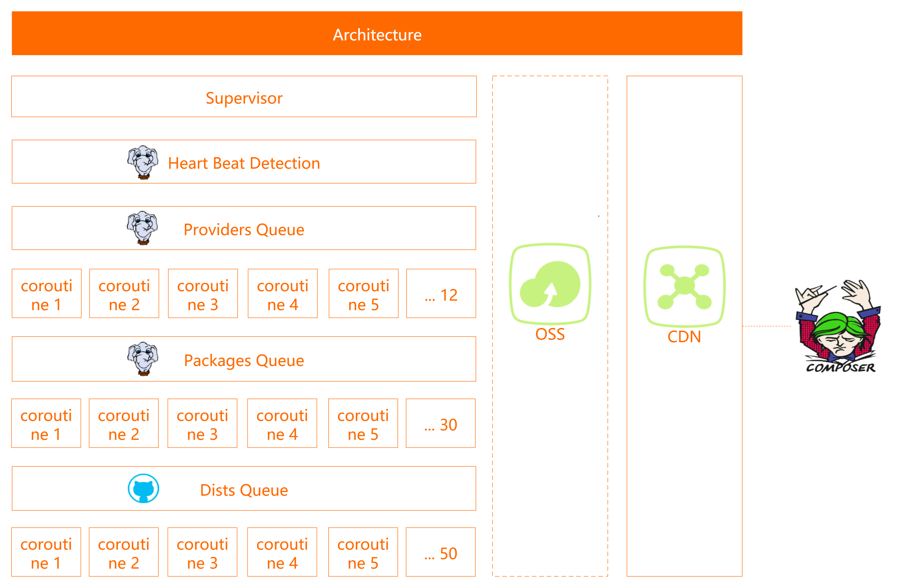

[English](/README.md) | 简体中文


# Alibaba Cloud Packagist Mirror
[](https://github.com/aliyun/packagist-mirror/actions/workflows/go.yml)
[](https://codecov.io/gh/aliyun/packagist-mirror)
[](https://goreportcard.com/report/github.com/aliyun/packagist-mirror)


Alibaba Cloud Packagist Mirror 是阿里云帮助 PHP 开发者加速安装 [Composer](https://getcomposer.org) 依赖包的开源系统。欢迎使用 [阿里云 Composer 全量镜像](https://developer.aliyun.com/composer)。


## 快速使用
若要运行本系统，请在项目根目录下创建 `packagist.yml` 文件，并配置以下选项：
> 为了安全，请不要将 `packagist.yml` 文件加入版本控制。

```yaml
REDIS_ADDR: "地址:端口"
REDIS_PASSWORD: "密码"
REDIS_DB: 0

OSS_ACCESS_KEY_ID: "OSS AccessKeyID"
OSS_ACCESS_KEY_SECRET: "OSS AccessKeySecret"
OSS_ENDPOINT: "OSS Endpoint，如：oss-cn-hangzhou.aliyuncs.com"
OSS_BUCKET: "Bucket"

# 为了请求 Dist 不受限制
GITHUB_TOKEN: "Github Token，如：6a023b828b17*****0ab5tgj6ddb3f0ccb3d30e0"

REPO_URL: "同步源地址，如：https://mirrors.aliyun.com/composer/"
API_URL: "变更监测API地址，如：https://packagist.org/"
MIRROR_URL: "镜像网址，如：https://developer.aliyun.com/composer/"
DIST_URL: "ZIP包下载地址，如：https://mirrors.aliyun.com/composer/dists/"
PROVIDER_URL: "Provider 前缀"

BUILD_CACHE: "true"

API_ITERATION_INTERVAL: 5
USER_AGENT: "Alibaba Cloud"
```


## 架构



## 贡献
欢迎网友参与开发，一起让 PHP 社区更加繁荣，提交 Pull Request 之前请阅读[贡献指南](/CONTRIBUTING.md)。


## 问题
[提交 Issue](https://github.com/aliyun/packagist-mirror/issues/new/choose)，不符合指南的问题可能会立即关闭。


## 发行说明
每个版本的详细更改记录在[发行说明](/CHANGELOG.md)中。


## 相关
* [Packagist](https://packagist.org/)
* [Composer](https://getcomposer.org)
* [最新源码](https://github.com/aliyun/packagist-mirror)


## 许可证
[Apache-2.0](/LICENSE.md)

Copyright (c) 2009-present, Alibaba Cloud All rights reserved.
