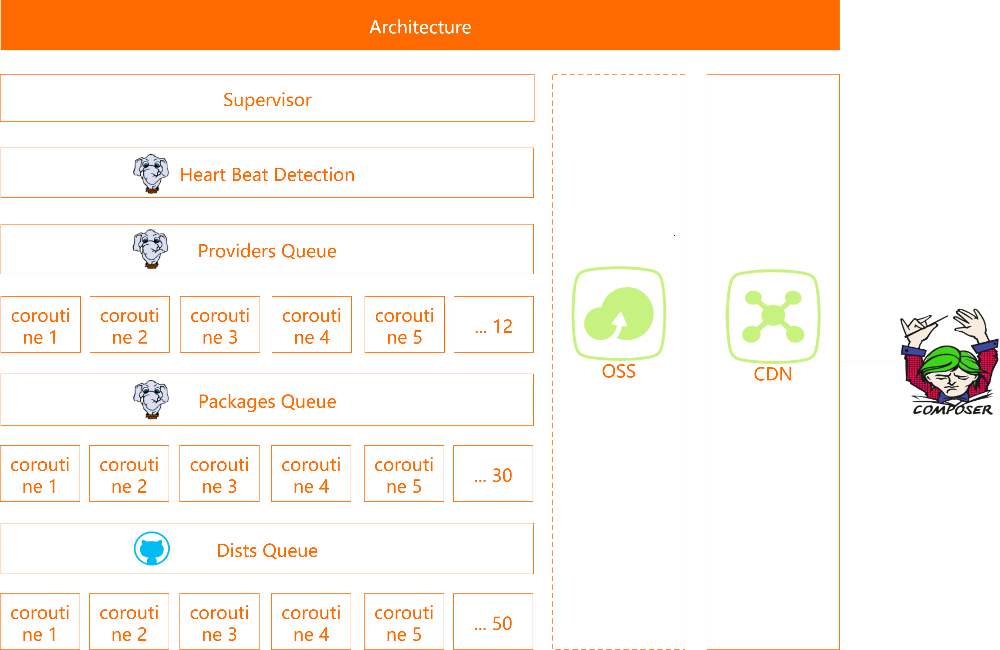

English | [简体中文](/README-zh-CN.md)


# Alibaba Cloud Packagist Mirror
[](https://goreportcard.com/report/github.com/aliyun/packagist-mirror)


Alibaba cloud packagist mirror is an open source system that Alibaba cloud helps PHP developers speed up the installation of [composer](https://getcomposer.org) dependent packages. Welcome to use [Alibaba Cloud Composer Mirror](https://developer.aliyun.com/composer).


## Quick Start
To run the system, create a `packagist.yml` file in the root directory of the project, and configure the following options:
> For security, please do not add the `packagist.yml` file to version control.

```yaml
REDIS_ADDR: "address:port"
REDIS_PASSWORD: "password"
REDIS_DB: 0

OSS_ACCESS_KEY_ID: "OSS AccessKeyID"
OSS_ACCESS_KEY_SECRET: "OSS AccessKeySecret"
OSS_ENDPOINT: "OSS endpoint, such as oss-cn-hangzhou.aliyuncs.com"
OSS_BUCKET: "Bucket name"

# Unlimited to request dist
GITHUB_TOKEN: "GitHub token, such as: 6a023b828b17*****0ab5tgj6ddb3f0ccb3d30e0"

REPO_URL: "Synchronization source address, such as https://mirrors.aliyun.com/composer/"
MIRROR_URL: "Mirror website, such as https://developer.aliyun.com/composer/"
DIST_URL: "Download address of zip package, such as https://mirrors.aliyun.com/composer/dists/"

PROVIDER_URL: "Provider prefix"
BUILD_CACHE: "true"
```


## Architecture



## Contribution
Welcome to participate in the development and make PHP community more prosperous together. Please read [contribution guide](/CONTRIBUTING.md) before submitting pull request.


## Issue
[Submit Issue](https://github.com/aliyun/packagist-mirror/issues/new/choose), problems that do not meet the guidelines may be closed immediately.


## Release notes
Detailed changes to each version are documented in [release notes](/CHANGELOG.md).


## References
* [Packagist](https://packagist.org/)
* [Composer](https://getcomposer.org)
* [Latest Release](https://github.com/aliyun/packagist-mirror)


## License
[Apache-2.0](/LICENSE.md)

Copyright (c) 2009-present, Alibaba Cloud All rights reserved.
